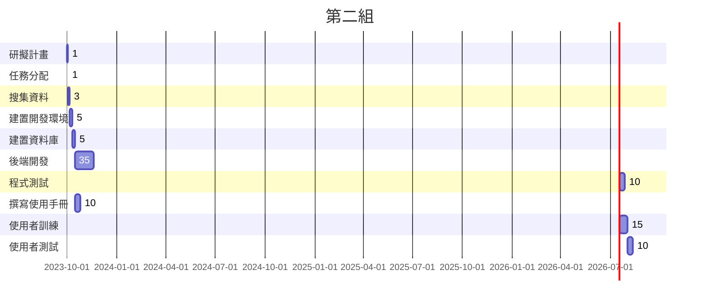

# C110118103-陳欣妤
## C110118103-陳欣妤
### C110118103-陳欣妤
#### C110118103-陳欣妤
##### C110118103-陳欣妤
###### C110118103-陳欣妤

` small zone `

``` big zone
1
2
```


[](https://www.youtube.com/watch?v=StTqXEQ2l-Y "Everything Is AWESOME")

[](https://www.youtube.com/watch?v=sSm2dRarhPo)

- [ ] todo list
- [x] done

```javascript
// Function to compute the product of p1 and p2
function myFunction(p1, p2) {
  return p1 * p2;
}
```

---
python code
```python
s = 'dsioerwjoiewofjg'
print(s)
```

:smile:
:thumbsup:

:musical_keyboard:
:hamburger:
:sunny:
:moneybag: :timer_clock: :white_check_mark:
:100:

| Left          | Center           | Right        |
| :------------ | :--------------: | ------------:|
| col 3 is      |  right-aligned   | `$1600`      |
| col 2 is      |  centered        | **$12**      |
| zeber stripes |  are neat        | *$1*         |

> 新北市
> > 板橋區

> > 中和區

**粗體**

*斜體*

~刪除線~

Emphasis, aka *italics*, whth *asterisks* or _underscores_.

Strong emphasis, aka **bold**, with **asterisks**, or __underscores__.

Combinded emphasis with **asterisks and _underscores_**.

Strikethrough uses two tildes. ~~Scratch this~~.

1.First order list item

2. Another item
   
   * Unordered sub-list

3. Actual numbers don't matter , just that it's a number.

   1. Ordered sub-list
   2. 2nd sub-list
       
4. And another item
   
     * note 1
   
     * note 2
   
     * note 3
  
  
python code
```python
s = "Python syntax highlighting"
print s
```

Javascript code
```javascript
var s = "JavaScript syntax highlighting"
alert(s);
```


#  甘特圖 
### Mermaid

